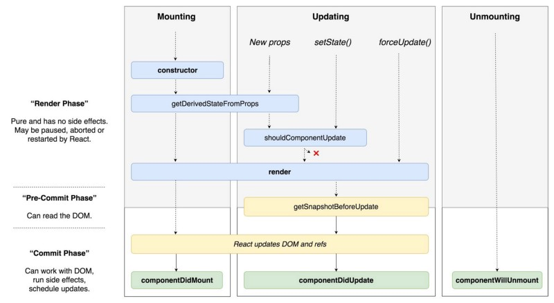

# Formation React

## Cycle de vie des composants

- Méthodes de Composant
  https://reactjs.org/docs/react-component.html

- Recommandations à propos des nouvelles méthodes
  https://medium.com/@valerii.sukhov/react-17-lifecycle-5b68946c813c

## Hooks

- Intro
  https://reactjs.org/docs/hooks-intro.html

- FAQ (très pratique quand on a l'habitude des méthodes de cycle de vie)
  https://reactjs.org/docs/hooks-faq.html

## Divers

- Les inconvénients de la POO
  https://medium.com/@cscalfani/goodbye-object-oriented-programming-a59cda4c0e53
